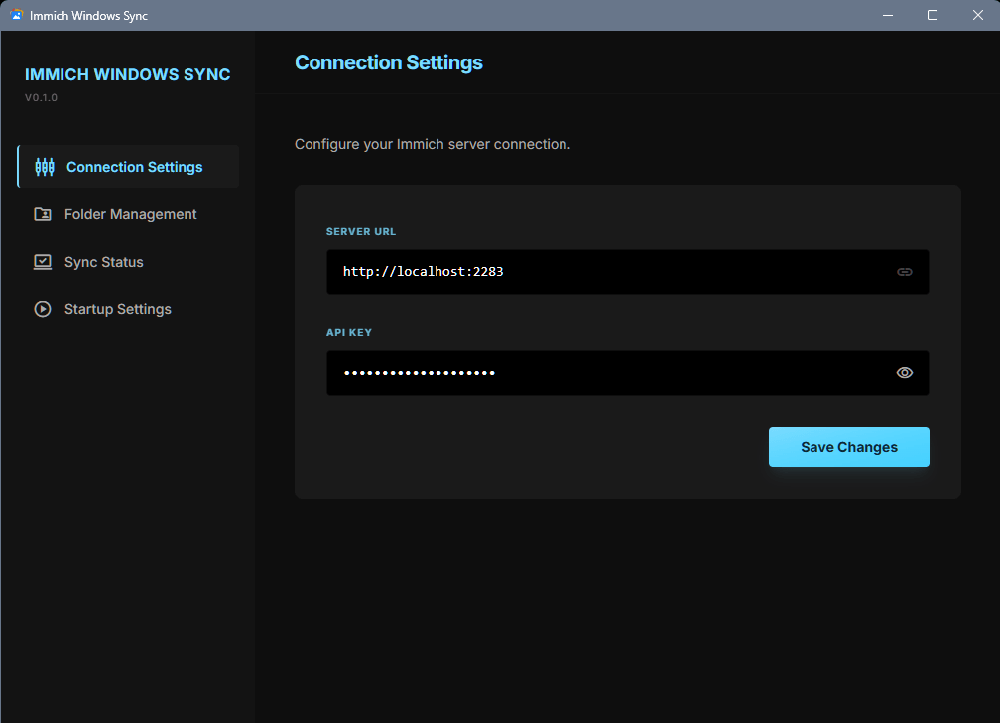
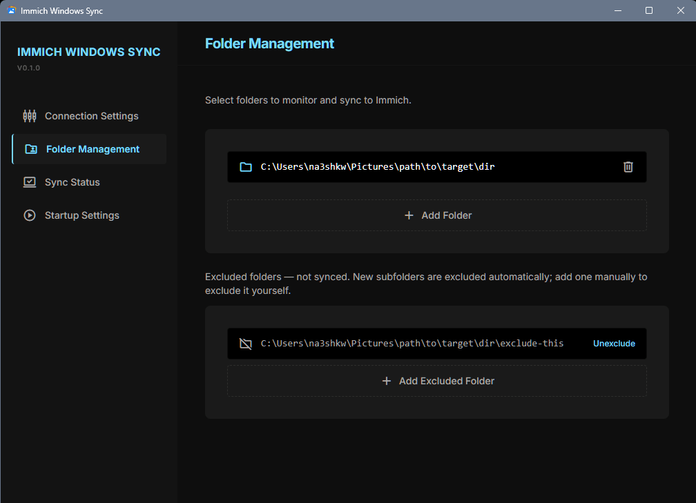
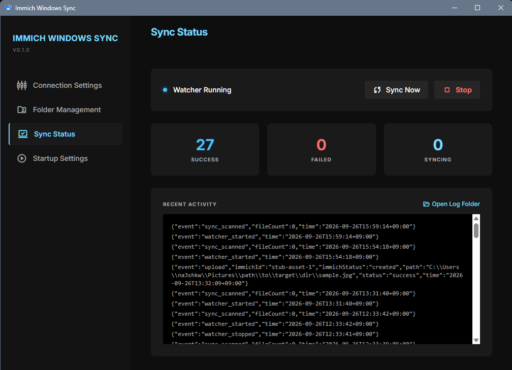
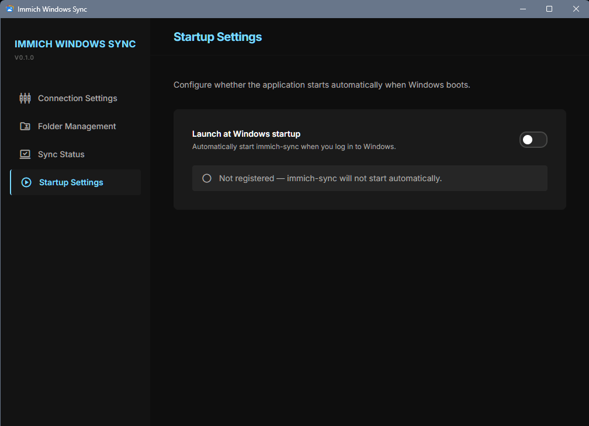

# Immich Windows Sync

<p align="center">
  
</p>

Windows 上で常駐し、指定したフォルダの画像・動画を [Immich](https://immich.app/) サーバーへ自動でアップロードするデスクトップアプリです。Google ドライブのデスクトップアプリのような「置いておけば勝手に同期される」使用感を目指しています。

## スクリーンショット

<p align="center">
  
  
  <br>
  
  
</p>

## 特徴

- **一方向同期**: Windows → Immich の一方向のみです。Windows 側でファイルを削除しても、Immich 上のアセットは削除されません
- **リアルタイム監視**: 対象フォルダ内のファイルの追加・変更を検知して、自動でアップロードします
- **初回スキャン**: 監視の開始時に、未同期のファイルをまとめてアップロードします
- **重複防止**: 同期状態を SQLite で管理し、アップロード済みのファイルは再送しません
- **除外フォルダ**: 監視対象フォルダの下にある特定のサブフォルダを、同期対象から外せます
  - 新しく作成されたサブフォルダは自動的に除外リストへ追加され、画面から解除できます
- **タスクトレイ常駐**: ウィンドウを閉じてもトレイに常駐し、トレイメニューから「開く」「終了」を操作できます
- **スタートアップ登録**: Windows へのログイン時に自動で起動します（Startup Settings 画面からオン・オフを切り替えられます）
- **同期ログ**: アップロード結果や Watcher の開始・停止を記録し、画面上で確認できます

## 動作環境

- Windows 10 / 11（WebView2 ランタイムが必要）
- Immich サーバーと、アップロード権限を持つ API キー

## インストール

[Releases](https://github.com/na3shkw/immich-windows-sync/releases) から最新版の `immich-windows-sync.exe` をダウンロードし、常設する場所に置くだけです（インストーラーはありません）。
[GitHub CLI](https://cli.github.com/) を使う場合は、PowerShell で次のように実行します。

<details>
<summary>インストールコマンド</summary>

```powershell
$dir = "$env:LOCALAPPDATA\Programs\immich-windows-sync"
New-Item -ItemType Directory -Force $dir | Out-Null
gh release download --repo na3shkw/immich-windows-sync --pattern "immich-windows-sync.exe" --dir $dir --clobber
& "$dir\immich-windows-sync.exe"
```

</details>

- 未署名のため、初回起動時に SmartScreen の警告が出ることがあります。「詳細情報」→「実行」で起動できます
- スタートアップ登録は exe のパスを記録します。登録後に exe を移動・改名した場合は、Startup Settings で登録し直してください
- アップデートする際は同じコマンドで exe を上書きします（起動中はトレイから終了してから実行してください）

### スタートメニューへの登録（任意）

<details>
<summary>ショートカット作成コマンド</summary>

```powershell
$s = (New-Object -ComObject WScript.Shell).CreateShortcut("$env:APPDATA\Microsoft\Windows\Start Menu\Programs\Immich Windows Sync.lnk")
$s.TargetPath = "$env:LOCALAPPDATA\Programs\immich-windows-sync\immich-windows-sync.exe"
$s.Save()
```

</details>

## アンインストール

アプリに設定や DB を削除する機能はないため、手動で削除します。

1. Startup Settings でスタートアップ登録を解除します
2. トレイメニューからアプリを終了します
3. 次のコマンドで exe と、設定・DB・同期ログを削除します

<details>
<summary>アンインストールコマンド</summary>

```powershell
Remove-Item -Recurse -Force "$env:LOCALAPPDATA\Programs\immich-windows-sync"
Remove-Item -Recurse -Force "$env:APPDATA\immich-sync"
Remove-Item -Recurse -Force "$env:LOCALAPPDATA\immich-sync"
Remove-Item -Force "$env:APPDATA\Microsoft\Windows\Start Menu\Programs\Immich Windows Sync.lnk" -ErrorAction SilentlyContinue
```

</details>

設定に保存された API キーも消えます。Immich 上のアップロード済みアセットには影響しません。

## 使い方

1. アプリを起動します
2. Connection Settings で Immich の **Server URL**（例: `http://immich.example.com:2283`）と **API Key** を入力して保存します
3. Folder Management で同期したいフォルダを追加します
4. 監視が始まり、フォルダ内の画像・動画が自動で Immich にアップロードされます

「Sync Now」ボタンでいつでも手動スキャンを実行できます。同期に失敗したファイルやログも画面から確認できます。

## データの保存場所

| ファイル | 本番ビルド | dev ビルド（`wails dev`） |
|---------|-----------|--------------------------|
| 設定 | `%APPDATA%\immich-sync\config.json` | `%APPDATA%\immich-sync-dev\config.json` |
| 同期状態 DB | `%LOCALAPPDATA%\immich-sync\syncdata.db` | `%LOCALAPPDATA%\immich-sync-dev\syncdata.db` |
| 同期ログ | `%LOCALAPPDATA%\immich-sync\sync.jsonl` | `%LOCALAPPDATA%\immich-sync-dev\sync.jsonl` |

dev ビルドは本番の設定・DB・ログに影響しないよう保存先が分かれています。スタートアップ登録のレジストリキー名も dev/本番で別です。

## 開発

### 必要なもの

- [Go](https://go.dev/) 1.25 以上
- [Node.js](https://nodejs.org/) / npm
- [Wails CLI](https://wails.io/) v2（`go.mod` の `github.com/wailsapp/wails/v2` と同じバージョン。次のコマンドで入れられます。）
  ```sh
  go install "github.com/wailsapp/wails/v2/cmd/wails@$(go list -m -f '{{.Version}}' github.com/wailsapp/wails/v2)"
  ```

### 技術スタック

| 用途 | 技術 |
|------|------|
| 言語 | Go |
| GUI | Wails v2（WebView2） |
| フロントエンド | React / TypeScript / Tailwind CSS v3 |
| ファイル監視 | fsnotify |
| データベース | SQLite（`modernc.org/sqlite`、CGO 不要） |
| タスクトレイ | getlantern/systray |

### 開発モードで起動

```sh
wails dev
```

Vite の開発サーバーが立ち上がり、フロントエンドの変更がホットリロードされます。`-tags dev` でビルドされるため、データは `%APPDATA%\immich-sync-dev\` と `%LOCALAPPDATA%\immich-sync-dev\` に保存されます。

### Immich スタブサーバー

本物の Immich を使わずに動作確認したい場合は、アップロード API（`/api/assets`）だけを模倣するスタブサーバーを利用できます。ディスクには何も書き込まないため、後片付けが不要です。

```sh
go run ./tools/immich-stub -addr 127.0.0.1:2283
```

Connection Settings の Server URL を `http://localhost:2283` に、API Key は任意の値に設定してください。

### テスト

```sh
go test ./internal/...
```

### ビルド

```sh
wails build
```

`build/bin/immich-windows-sync.exe` が生成されます。

### ディレクトリ構成

```
├── main.go              # エントリーポイント（多重起動防止・Wails 起動）
├── app.go               # アプリ本体。Syncer と Watcher の仲介役
├── frontend/            # React / TypeScript UI
├── internal/
│   ├── appenv/          # dev/本番で切り替わる値（データフォルダ・レジストリキー名）
│   ├── config/          # 設定の読み書き
│   ├── db/              # SQLite による同期状態管理
│   ├── debounce/        # ファイルイベントのデバウンス
│   ├── immich/          # Immich API クライアント
│   ├── singleinstance/  # 多重起動防止（名前付き Mutex）
│   ├── startup/         # Windows スタートアップ登録（レジストリ）
│   ├── syncer/          # 同期ロジック・ワーカープール
│   ├── synclog/         # 同期ログ（JSON Lines）の書き込み・読み出し
│   ├── tray/            # タスクトレイ常駐（アイコン・メニュー）
│   └── watcher/         # ファイル監視（fsnotify）
├── tools/immich-stub/   # 動作確認用の Immich スタブサーバー
├── docs/
│   ├── adr/             # 設計判断の記録（ADR）
│   └── screenshots/     # README 用のスクリーンショット
└── build/               # Wails ビルド設定・アイコン
```

### 設計判断の記録

主な設計判断とその理由は [docs/adr/](docs/adr/README.md) に ADR（Architecture Decision Record）としてまとめています。
